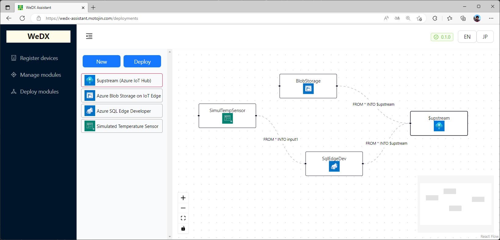

# WeDX Assistant

[WeDX Assistant](https://wedx-assistant.motojin.com) is a next-generation web application that takes advantage of [Azure IoT Edge](https://azure.microsoft.com/en-us/products/iot-edge) and Edge computing to provide seamless device management.

[WeDX Assistant](https://wedx-assistant.motojin.com) with a node graph editor, users can easily visualize and deployment modules. Additionally, the application enables users to manage modules as containers and deploy them to devices on the edge, providing greater flexibility and scalability. 

By utilizing Azure IoT Edge, [WeDX Assistant](https://wedx-assistant.motojin.com) offers secure and reliable device management, while also providing the benefits of edge computing such as reduced network bandwidth and increased efficiency. The result is a powerful solution that empowers users to harness the full potential of edge computing.

[](https://www.gnu.org/licenses/agpl-3.0.html)




## 📌 Get Started

### Prerequisites

for Development

- [Git client](https://git-scm.com/downloads)
- [Node.js v16](https://nodejs.org/en/download/)

for Operations

- [Microsoft Azure](https://azure.microsoft.com/) resources
  - [App Service](https://azure.microsoft.com/en-us/products/app-service)
  - [Azure Cosmos DB](https://azure.microsoft.com/en-us/products/cosmos-db)
  - [Azure IoT Edge](https://azure.microsoft.com/en-us/products/iot-edge)

### Installation

```powershell
> npm install
> copy .env.local.sample .env.local
> npm run dev
```


## 📌 Development commands

```powershell
> npm run dev
  Starts the development server

> npm run build
  Builds the app for production

> npm run lint
  Lint the app

> npm start
  Runs the built app in production mode
```


## 📌 Sponsors

Sponsored by [motojin.com, Inc.](https://motojin.com), this project is focused on developing innovative edge computing solutions and data migration services for Microsoft Azure.

[](https://motojin.com)


## 📌 Licenses

WeDX Assistant is available under the GNU AGPL-3.0 license. The licenses for assets, fonts, and models are listed in the appropriate project folders.
